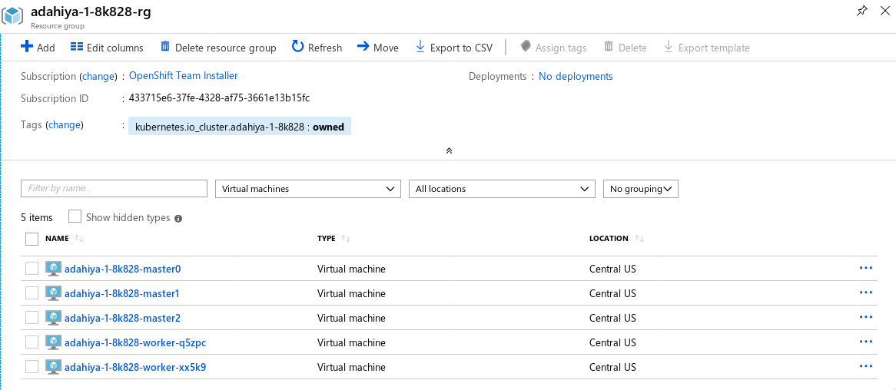

# Cluster Installation

At this point, you are ready to perform the OpenShift installation. See below for an example of an
IPI install.

## Example: Installer-Provided Infrastructure (IPI)

The steps for performing an IPI-based install are outlined [here][cloud-install]. Following this guide you may begin at
Step 3: Download the Installer.

### Setup your Red Hat Enterprise Linux CoreOS images

OpenShift currently does not publish official build for [`Red Hat Enterprise Linux CoreOS`][rhcos] boot images. Therefore, currently users are required to import boot image to their subscription before using the installer to create clusters on Azure.

1. Create a Storage Account to hold the blobs in a shared Resource Group.

    ```sh
    az storage account create --location centralus --name os4storage --kind StorageV2 --resource-group os4-common
    ```

    ```sh
    az storage container create --name vhd --account-name os4storage
    ```

1. Create a Resource Group for the image.

    ```sh
    az group create --location centralus --name rhcos_images
    ```

1. Copy the image blob into the storage container in the Storage Account.

    ```sh
    ACCOUNT_KEY=$(az storage account keys list --account-name os4storage --resource-group os4-common --query "[0].value" -o tsv)
    ```

    ```sh
    VHD_NAME=rhcos-410.8.20190504.0-azure.vhd
    ```

    ```sh
    az storage blob copy start --account-name "os4storage" --account-key "$ACCOUNT_KEY" --destination-blob "$VHD_NAME" --destination-container vhd --source-uri "https://openshifttechpreview.blob.core.windows.net/rhcos/$VHD_NAME"
    ```

1. Create an image from the copied VHD

    ```sh
    RHCOS_VHD=$(az storage blob url --account-name os4storage -c vhd --name "$VHD_NAME" -o tsv)
    ```

    ```sh
    az image create --resource-group rhcos_images --name rhcostestimage --os-type Linux --storage-sku Premium_LRS --source "$RHCOS_VHD" --location centralus
    ```

### Create Configuration

```console
[~]$ openshift-install create install-config
? SSH Public Key /home/user_id/.ssh/id_rsa.pub
? Platform azure
? azure subscription id xxxxxxxx-xxxx-xxxx-xxxx-xxxxxxxxxxxx
? azure tenant id xxxxxxxx-xxxx-xxxx-xxxx-xxxxxxxxxxxx
? azure service principal client id xxxxxxxx-xxxx-xxxx-xxxx-xxxxxxxxxxxx
? azure service principal client secret xxxxxxxx-xxxx-xxxx-xxxx-xxxxxxxxxxxx
? Region centralus
? Base Domain example.com
? Cluster Name test
? Pull Secret [? for help]
```

### Create Cluster

```console
[~]$ openshift-install create cluster
INFO Waiting up to 30m0s for the Kubernetes API at https://api.test.example.com:6443...
INFO API v1.11.0+85a0623 up
INFO Waiting up to 30m0s for the bootstrap-complete event...
INFO Destroying the bootstrap resources...
INTO Waiting up to 30m0s for the cluster at https://api.test.example.com:6443 to initialize...
INFO Waiting up to 10m0s for the openshift-console route to be created...
INFO Install complete!
INFO To access the cluster as the system:admin user when using 'oc', run 'export KUBECONFIG=/home/user/auth/kubeconfig'
INFO Access the OpenShift web-console here: https://console-openshift-console.apps.test.example.com
INFO Login to the console with user: kubeadmin, password: 5char-5char-5char-5char
```

Note that Azure support is still in development and as a result, certificate signing requests (CSRs) for compute nodes will need to be manually approved before the cluster will complete installation. The list of CSRs can be viewed using the `oc` client tool:

```console
[~]$ oc get csr
NAME        AGE     REQUESTOR                                                                   CONDITION
csr-4f5cm   3m50s   system:serviceaccount:openshift-machine-config-operator:node-bootstrapper   Pending
csr-5pldl   13m     system:node:test-gbwvn-master-0                                             Approved,Issued
csr-6ngbz   12m     system:serviceaccount:openshift-machine-config-operator:node-bootstrapper   Approved,Issued
csr-6rb9t   13m     system:node:test-gbwvn-master-1                                             Approved,Issued
csr-9b4fx   13m     system:serviceaccount:openshift-machine-config-operator:node-bootstrapper   Approved,Issued
csr-hkswn   75s     system:serviceaccount:openshift-machine-config-operator:node-bootstrapper   Pending
csr-rb8fh   13m     system:serviceaccount:openshift-machine-config-operator:node-bootstrapper   Approved,Issued
csr-s9pzp   13m     system:serviceaccount:openshift-machine-config-operator:node-bootstrapper   Approved,Issued
csr-tlq5m   12m     system:node:test-gbwvn-master-2                                             Approved,Issued
csr-wgzhj   6m15s   system:serviceaccount:openshift-machine-config-operator:node-bootstrapper   Pending
```

CSRs can be approved as follows:

```console
[~]$ oc adm certificate approve csr-4f5cm
certificatesigningrequest.certificates.k8s.io/csr-4f5cm approve
```

It can be expected that three CSRs will need to be approved as part of the default installation. The following command can be used to approve all pending CSRs: `oc get csr --no-headers | grep Pending | awk '{print $1}' | xargs --no-run-if-empty oc adm certificate approve`.

### Running Cluster

In your subscription, there will be a new Resource Group for your cluster:


There will be six running Virtual Machines in the Resource Group.



The nodes within the Virtual Network utilize the internal DNS and use the Router and Internal API load balancers. External/Internet
access to the cluster use the Router and External API load balancers.

The OpenShift console is available via the kubeadmin login provided by the installer:


[cloud-install]: https://cloud.openshift.com/clusters/install
[rhcos]: https://github.com/openshift/os
